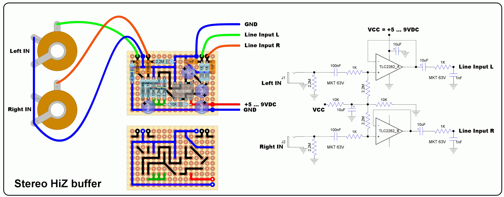

## Simple Stereo DIY audio buffer  
Here is as simple opamp based stereo buffer project which can be built on a piece of perfboard using through hole components. It provides a high impendace instrumental inputs for boards like the Teensy Audio Adaptor. Connect the buffer outputs to the stereo Line input of the Teensy Audio Adaptor.  
  
The TLC2262 (or TLC2272) dual opamp is a rail-to-rain IO one and can be used either with a 5V supply or a typical 9VDC adapter used for guitar pedals.  

