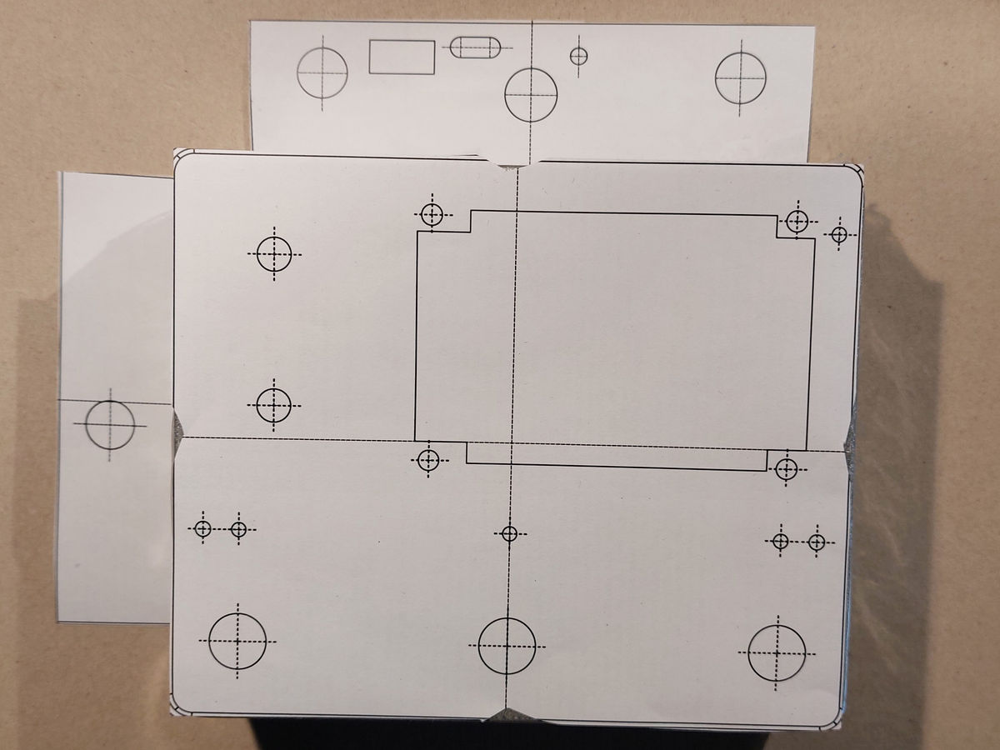
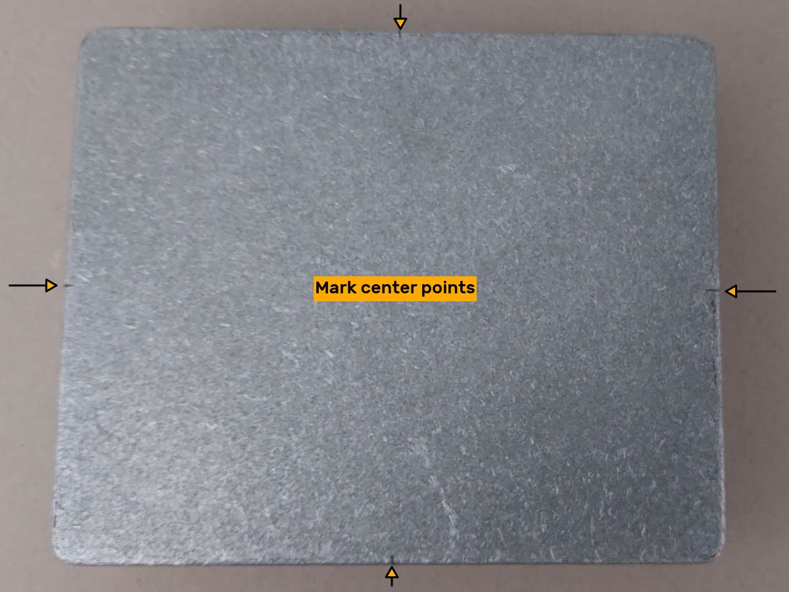
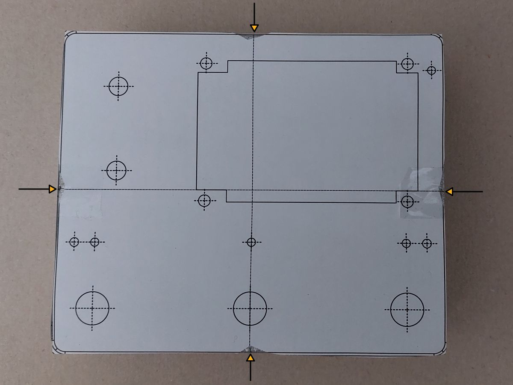
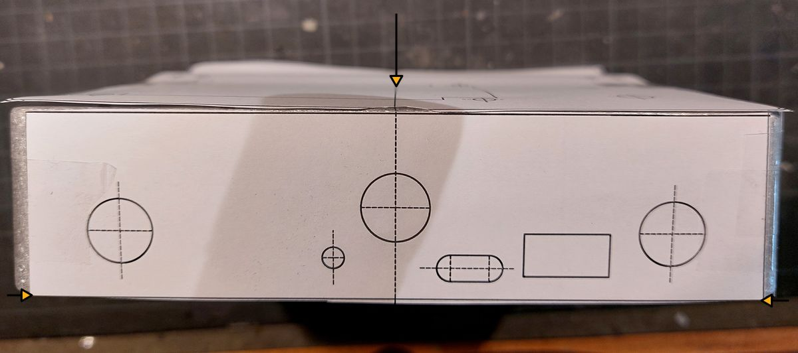
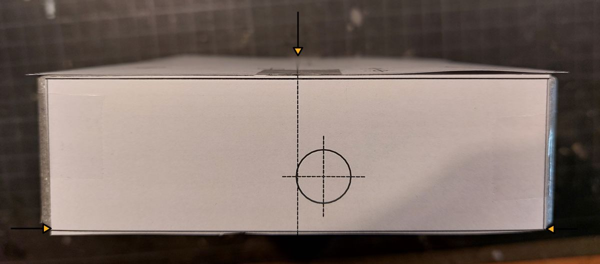
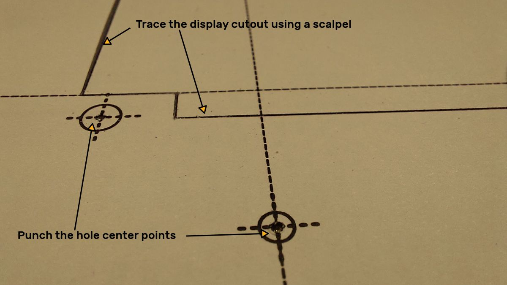
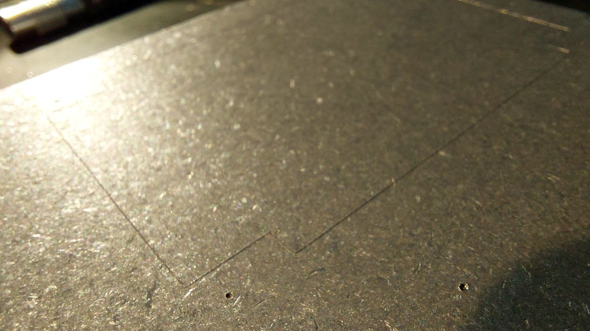
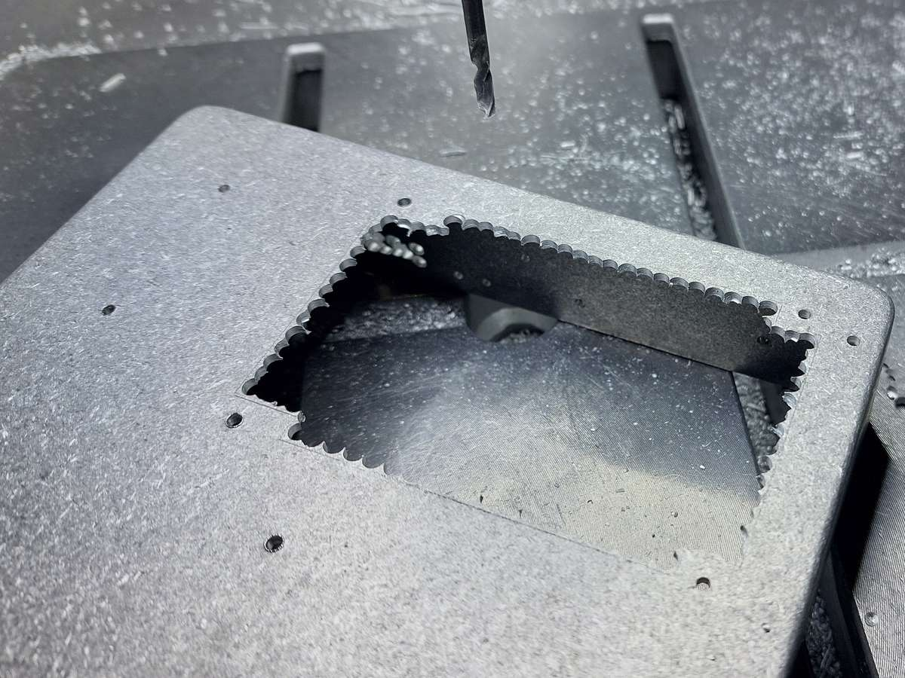
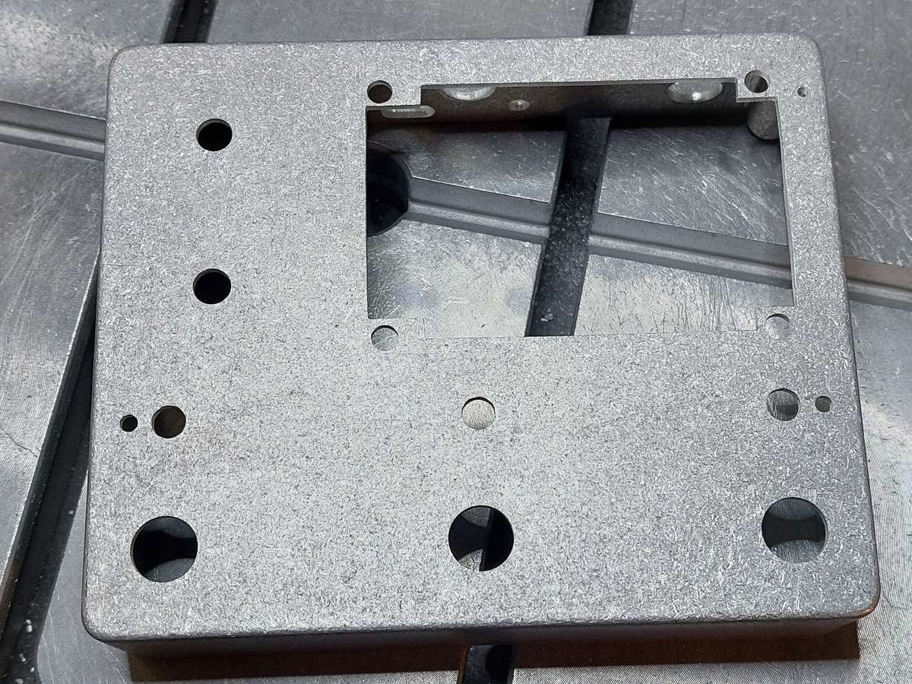

## TGX4 - making the enclosure  
TGX4 is designed to fit into a diecast aluminium box made by Hammond: model **1590XX**.  
A drill layout file in 1:1 scale is provided in the `Mechanical` folder.  
Build process (manual, no CNC):  
1.  Print out the drill layout and cut to size for all 3 surfaces.
  
2. Mark the center points on the sides of the enclosure.  
  
3. Match the center lines with the marked points and fix the drill guide with a tape.
  
  
  
4. Punch the center holes and mark the cutouts using a sharp knife or a scalpel.  
  
  
5. Drill the holes and make the cutouts.  
  
6. Finished enclosure ready for painting.  
  

---  
(c) 2024 by Piotr Zapart  
www.hexefx.com  