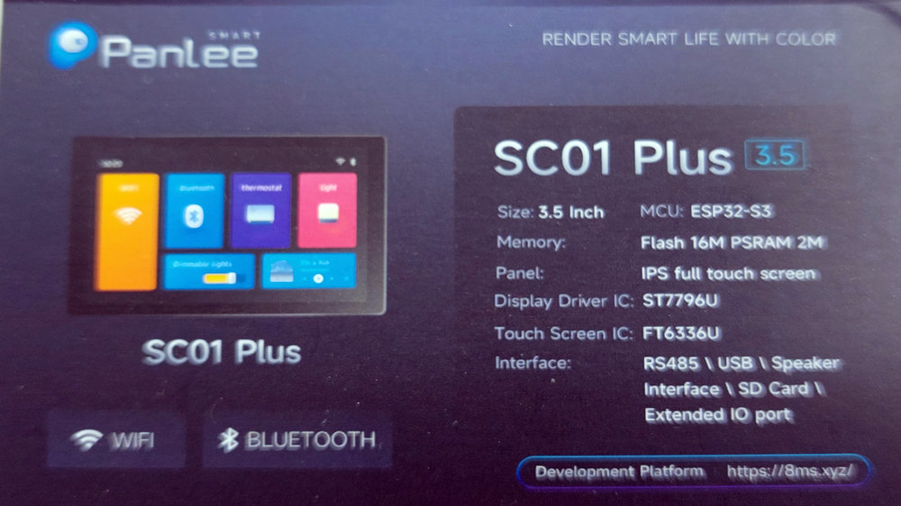

## TGX4 Dedicated Hardware Platform  
### Features:  
- Stereo input/output, electronic (FET) bypass  
- Analog Dry/Wet mixer  
- 32bit 44.1kHz ADC + DAC
- Optional codec module replacing the default ADC+DAC  
- Flexible control interface options, default: TFT+Touch screen (W32SC01_plus)  
- Analog signal presence and clip indicator  
- Teensy4.1 as main DSP
- Expression pedal input (can be used as 0-3.3V CV input)
- 3 configurable footswitches
- up to 3 configurable pot (default: 1)  
- 3 leds  
- USB device (MIDI + Serial - Teensy)
- USB host
- Enclosure: Hammond 1590XX  
---  
![alt text][img_3d1]  
![alt text][img_3d2]  
![alt text][img_pcb1]  

### Assembly  
![alt text][img_top]  
![alt text][img_btm]  

### Building  
#### 1. Main PCB  
KiCad project is provided in the `KiCad_proj/MainBoard` folder.  
The main PCB is a 4 layer one. A zip file with Gerbers is included and can be used to order a set of the boards. I do recommend ordering a stencil for the bottom layer.  
![alt text][img_pcb2]  

Interactive HTML BOM is available and will help with hand placing the components. Most of the passives are 0805 and larger.  
![alt text][img_pcb3]  

There are various jumpers included on the main PCB. They are pre-set for default configuration.
1. **CLIP SELECT** The AK5552 ADC has an input signal clip indicator which is used to drive the red part of the SignalPresence/Clip indicator. This might not be the case for other codecs/ADCs. Signal Clip line can be also driven directly from Teensy's **GPIO34**. To enable it the jumper has to be bridged. Default source is the ADC.  
2. **ADC MASTER/SLAVE** selector. Default setting is Slave - Teensy generates all the required I2S clocks.  
3. **ADC ADDR** I2C address used to configure the AK5552 chip.  
4. **DAC ADDR** I2C address used to configure the AK4452 chip. 
5. **13/36** near the display connector. Footswitch signals are routed to the ESP32S2 board, one can be swapped for the GPIO36 and used for other tasks.  
6. **EXPSNS=A0|14** Expression pedal detection is routed to GPIO14 (default). To free the GPIO14 when no expression pedal is used, make the jumper open.  
7. **EXP=A1|15**  Expression pedal signal. By default routed to GPIO15 (jumper closed).  
8. **10k PULL-UP** a test point providing a 10k 3.3V pull up resistor in case it's needed. 

Top layer are mainly through-hole components, except the USB-C connector for the Teensy and the LEDs.  
![alt text][img_pcb4] 
### Caution!  
<h2>While connecting the Teensy and the ESP32 to the USB sockets leave the VBUS 5V wire disconnected!</h2>  

![alt text][img_5] 
#### 2. Making the enclosure  
See [>>>> here <<<<](enclosure.md).  

### Display  
The ESP32S3 + Touch display board used in this project is the WT32SC01Plus. There are many variants of the ESP32+display boards floating around, here are the specs of the used one:  
  

----  
Copyright (c) 2024 by Piotr Zapart  
www.hexefx.com  

[img_3d1]: img/TGX4_3d6.jpg "Render 1"
[img_3d2]: img/TGX4_3d7.jpg "Render 2"
[img_pcb1]: img/tgx4_1.jpg "PCB bottom view" 
[img_top]: img/PCB_Top_Assembly.jpg "Assembly top" 
[img_btm]: img/PCB_btm.jpg "Bottom view"

[img_pcb2]: img/TGX4_pcb1.jpg "PCB"
[img_pcb3]: img/TGX4_pcb2.jpg "PCB"
[img_pcb4]: img/TGX4_pcb3.jpg "PCB"

[img_5]: img/tgx4_assembly1.jpg "Display assembly"