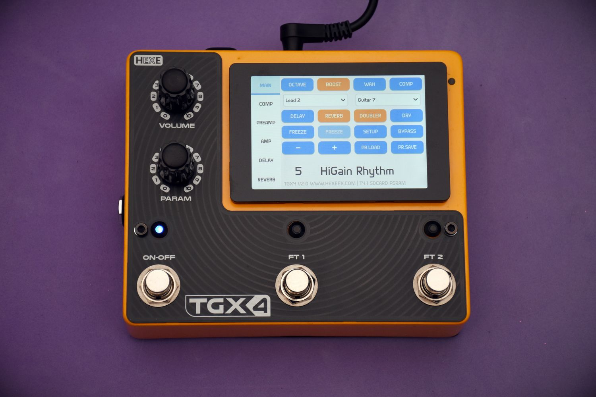
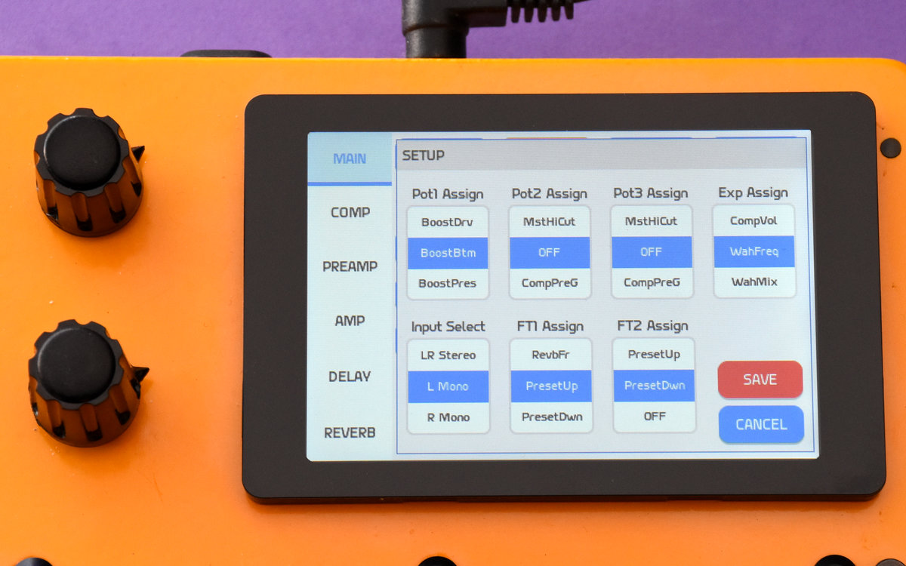
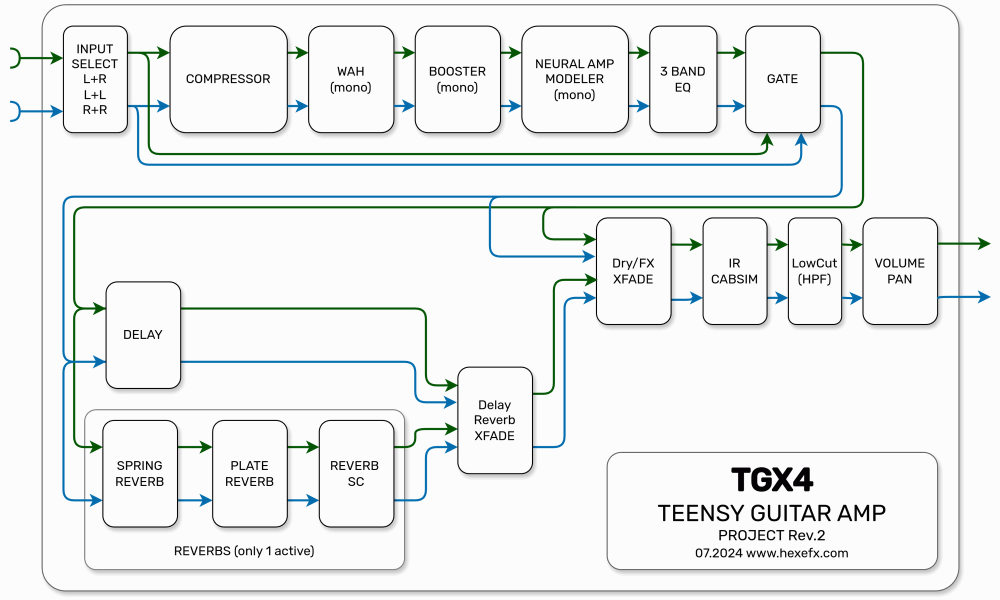
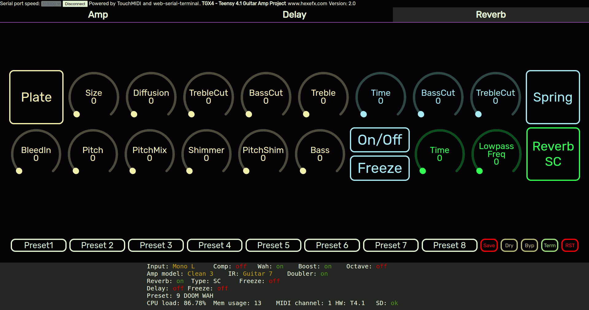
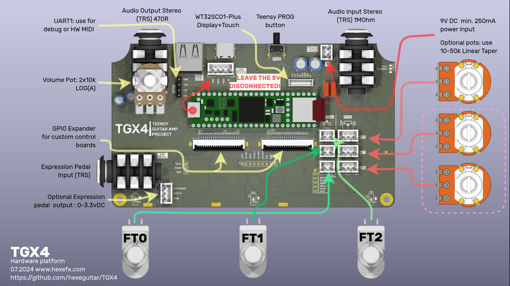

## TGX4 - Teensy Guitar Amp Project
  

This project aims at creating a nice usable set of guitar and bass tones while using relatively inexpensive hardware and being simple to build.  
It combines a Neural Network amp modeler with stereo IR cabinet emulation, versatile stereo Ping-Pong delay and 3 different reverbs. There is also a Compressor, Wah and Booster with octave up mode for further input tone shaping.  

### Change-log  
V2.1 - 12-2024 - Added Front Panel, bug fixes  
V2.0 - 07-2024 - Dedicated hardware platform  
V1.4 - 04.2024 - Multiple hardware platforms added  
V1.3 - 03.2024 - Initial release.  

### User Interface  
#### HTML webpage
In general all the parameters are controlled via MIDI. There is a lot of controls and to make the hardware less expensive and easier to build the starting point is a simple html page using WebMIDI + WebSerial, which, opened in one of the supported browsers (Chrome, Opera, Edge) offers a full GUI interface.  
Teensy is using the USB Serial port to show the status and other info about the current state.  
Usage:  
1. Plug the Teensy with uploaded firmware into the USB port.
2. Open the TGX4.htm page (html folder) in any of the supported browsers.
3. Choose Teensy MIDI for the MIDI interface.
4. Click _Connect_ and choose the Teensy Serial port.
5. Press _Term_ button to switch between the status report and the CLI.
6. Use dials and buttons to control the effects.  

  

#### Touchscreen GUI  
A separate project is provided for the **WT32SC01Plus board** (ESP32-S3 + 3.5" 480x320 IPS display, capacitive touchscreen) which is the main and dedicated user interface allowing access to all controls and functions of the pedal.  
The GUI is created using LVGL9 library:    

  
### Internal structure 

  

## Signal Flow  
The signal flow, except three components is stereo. The three mono components are: **Wah**,  **Booster** and **Neural Amp Modeler**. Mono means, these two sum the input signal into one and send one output to both L and R channels when enabled. In bypass mode both mono blocks pass the stereo signal unaffected. This way the TGX4 can be used either with mono source or as stereo effects processor (with Wah,  Booster and Amp Modeler disabled).
1. **Input Select** - controls which input channel use as source:  
	* L+R - stereo input
	* L+L - left mono input
	* R+R - right mono input
2. **Compressor** - stereo dynamic compressor with wide variety of controls:  
	* Pregain - input gain  
	* Threshold  
	* Ratio  
	* Attack, Release  
	* PostGain (MakeUp)  
3. **Wah** - mono wah implementation:  
	* 8 available models  
	* Frequency control  
	* Mix - dry/wet mixer  
4. **Booster** - an oversampled wave shaper based on 12AX7 tube curve:  
	* Drive - overdrive level  
	* Bottom - input highpass filter  
	* Presence - treble control  
	* Mix - dry/wet(distorted) mixer ratio, useful for Bass!  
	* Level - Booster output volume
	* Octave - analog octave up emulation  
5. **Neural Amp Modeler** 8 models available, from, clean channels, through light crunch to high gain lead ones:
	* Gain - controls the input signal level
6. **3 Band EQ** - this EQ is a "passive" one, meaning the flat response is when all controls are at max. Use for slight tone adjustments. Most of the "amp" sounds are already modelled in the previous block.  
7. **Gate** - adjustable Noise Gate. Noise gate is using the clean input signal for the side chain path, this way the threshold does not have to be adjusted for different distortion levels.
8. **Time Based FX Section** consisting of two effects in parallel: Stereo Ping-Pong delay with modulation and one of 3 available Reverbs. There are two main controls for this section:  
	* FX Mix - controls the dry sound vs Time FX sound mix ratio. Use to set the balance between the main sound and the Delay + Reverb combo  
	* Delay/Reverb Mix - this mixer controls the balance between the delay and reverb outputs.
9. **Stereo Cabinet Emulator / IR convolver**:  
	* 7 guitar cabinet models  
	* 3 bass cabinet models  
	* Stereo Doubler function emulating double tracking  
10. **Output Section**:  
      * Master Lowcut - output highpass filter to control the low end range  
      * Pan - Left/Right panorama setting  
      * Volume - final output volume   
  
### Stereo Ping-Pong delay  
One of the time based effects, versatile 1 second delay with modulation and Freeze feature (looper mode). Controls:  
   * Time - delay time  
   * Inertia - how fast the delay time is updated after change. Creates weird pitch shifting effects  
   * Repeats - amount of feedback  
   * HiCut - low pass filter inside the delay path, controls the treble loss for each repeat. Many delays implement such feature and claim to make the sound "analog"  
   * LowCut - high pass filer inside the delay path, controls the bass loss for each repeat  
   * Treble - overall treble control to make the sound darker
   * Bass - output bass control for further delay tone shaping  
   * ModRate - modulation rate (internal LFO speed)
   * ModDepth - modulation depth (internal LFO depth)
   * Tap Tempo  
   * Freeze mode - mutes the input signal and lets the echo repeat infinitely  

     

## Reverb Section  
There are 3 types of reverb built in, **only one can be active** at a time:  
1. **Plate Reverb** - versatile lush sounding long reverb:  
	* Size - reverb time  
	* Diffusion - lower values create more echo effects inside the reverb tail  
	* Treble Cut - treble loss in the reverb tail, affects the reverb time  
	* Bass Cut - bass loss in the reverb tail, affects the reverb time  
	* Treble - output treble control for the reverb wet signal  
	* Bass - output bass controls fot the reverb wet signal  
	* Pitch - reverb pitch set in semitones (range -12 to +24)  
	* Pitch Mix - mix ratio for the pitched up/down and natural pitch signal (creates harmonies)  
	* Shimmer - amount of shimmer effect  
	* Pitch Shim - shimmer effect pitch setting  
	* Freeze mode - creates infinite reverb sound  
	* Bleed In - amount of input signal fed into the reverb while in Freeze mode.  
2. **Reverb SC** based on Sean Costello's reverb algorithm using multiple feedback delay lines *(available only with PSRAM installed)*:  
	* Time - reverb time  
	* Lowpass Freq - tail treble loss  
	* Freeze mode - infinite reverb sound  
3. **Spring Reverb** - for more classic guitar tones, emulation of a typical spring reverb tank:  
	* Time - reverb time  
	* Bass Cut - high pass filter
	* Treble Cut - lowpass filter  

   

Press **Plate**, **Spring** or **ReverbSC** button to activate the reverb.  

## Hardware  
In the simplest form, this project can run on a Teensy 4.0 or T.4 and the audio adapter board.  
Adding PSRAM to the Teensy4.1 opens up the full set of features. Lack of PSRAM results in:  
- ReverbSC disabled,
- Delay has a shorter time range.  
  
Recommended upgrade would be a high impedance input buffer using an opamp or even a simple transistor one.  
See [**here**](diy_buffer.md) for a simple DIY project. 
Alternatively, another pedal with buffered bypass can be used instead.  

The hardware build option is set either in the `platformio.ini` file  
`default_envs = t40_audio_board`  
or by invoking the build command from the terminal:  
`pio run -e t40_audio_board`  

List of pre configured hardware platforms as of July 2024:  
- `hexefx_tgx4` - Dedicated hardware platform for this project using 32bit AKM converters.
- `t40_audio_board` - Teensy4.0 + Audio Adaptor Board  
- `t41_audio_board` - Teensy4.1 + Audio Adaptor Board 
- `t40_blackaddr_tgapro` - Blackaddr TGA Pro + Teensy4.0  
- `t41_blackaddr_tgapro` - Blackaddr TGA Pro + Teensy4.1   
 
The project is designed to be easily adaptable to many Teensy based hardware platforms, take a look [**here**](hw_platform.md) for more details.  
### Caution!  
A high gain sound, like the Preset 5 might and do create a feedback and oscillation on some of the hardware platforms, namely the SGTL5000 and ES8388. The noise gate can cut it off, although some oscillation will be audible when the gate closes.  WM8731 seems to be more immune to oscillations.  
A very high gain devices require a careful layout and design to make them as silent as possible. It is also a reason for designing a dedicated HW platform for the TGX4 project which incorporates design techniques to minimize these issues.  
## TGX4 Hardware  
   
 Dedicated TGX hardware platform project is available in the `hardware/`  folder.  

## Usage  
1. Open the **TGX4_TeensyMainBoard** project in the PlatformIO environment.
2. Open the `platformio.ini` file and set the required hardware configuration.
3. Build the project and upload it to the Teensy4 board.
4. Open the **TGX4_WT32SC01PLUS_GUI** project in the PlatformIO environment.
5. Build the project and upload it to the Display board.
6. For the web page access open the `TGX4.html` file placed in the `html` folder in Chrome, Chromium or Edge browser (others do not implement WebMIDI and WebSerial).
7. Connect to the USB MIDI interface listed as Teensy.  
8. Click `Connect` button on the top of the page and choose Teensy Serial port.
9. Use the dials and buttons to control the device.  

## Preset System (no display version)
A snapshot of all controls (except Delay+Reverb Freeze modes) can be saved in 128 available preset slots. Preset System is using the SD card to store the files. If no SD card is detected, the number of presets is limited to 8, stored in EEPROM.
1. Choose the Preset slot by pressing the buttons **Preset 1** - **Preset 8**. Alternatively use the CLI console to load preset numbers over 8 using the command `preset-load n`, where `n` is the preset number in range 1-128.
2. Set a new name for the preset using the `preset-name xxxx` CLI command.
3. Press **Save** to store the current sound in the chosen preset.  

## Preset System (using the display GUI)  
Switching the presets can be done in two ways:  
1. Using the **+** and **-** buttons on the touch screen MAIN page. The new preset is loaded immediately. To reload the preset from the saved file (ie. restore to saved version) press the **PR.LOAD** button.
2. Using the footswitches. The default function of the middle footswitch is **Preset UP**, the right one **Preset DOWN**. Pressing one of the footswitches enables browsing through the presets without loading them. To activate the chosen preset press and hold down one footswitches (usually the last used one). Browsing is shown as a popup window with the number and the name of the preset.  
   
## Default Presets  
1. Clean guitar sound, spring reverb.
2. Lightly overdriven clean guitar sound with modulated delay used as a stereo chorus.  
3. Boost/Overdrive into Clean channel + Reverb SC. Uses Stereo Doubler to emulate double tracking. Bluesy rhythm tone.  
4. Crunch Amp + Boost, mono mode + stereo delay and reverb. Bluesy solo sound.
5. High gain rhythm tone, a bit of Spring Reverb, Stereo Doubler enabled.  Uses Booster for input tone shaping, low end cut and light overdrive.
6. High Gain solo tone with modulated delay and reverb.  
7. Clean Bass sound with compressor.
8. Distorted fuzzy stereo bass sound.  

## Demos  
https://www.youtube.com/watch?v=2hztEZ9_kYk  
  

https://www.youtube.com/watch?v=AlLRwmOwigU  
  

All guitar/bass sounds on this track were recorded using the TGX4:    
<a href="https://soundcloud.com/hexeguitar/tgx4?si=6f866569802b4d66984722fe57b7850a&utm_source=clipboard&utm_medium=text&utm_campaign=social_sharing"></img></a>

## Command Line Interface  
Use the **Term** button places on the main **Amp** page to switch between the status report and the CLI. Type `help` to list all the commands. CLI uses history and autocomplete.  
Available commands:  
- `preset-rst` - repopulates the 128 (or 8 without the SD card) available presets with default "factory" ones.  
- `preset-name` - sets the new name for the current preset. Argument: name, max 15 chars. Eg. `preset-name Solo-Delay`
- `preset-load` - loads the preset, argument: preset number 1-128.
- `preset-backup` - creates a copy of the 128 presets data in a separate `backup` directory on the SD card.
- `meminfo`- print RAM memory details  
- `load`- list CPU loads for all components  
- `midi-ch`- assign a new MIDI channel for the Teensy. Use it when controlling the device with other MIDI controllers. The WebMIDI interface sends the data on channel 1.  
- `i2c` - I2C scanner, takes one parameter: 0, 1 or 2 (Wire, Wire1, Wire2) and reports all found devices.
- `list` - lists all the files found on the SD card.

## Credits  
The Neural Network Modeler is based on implementation by [Keith Bloemer/GuitarML](https://github.com/GuitarML/Seed)  

[OpenAudio_ArduinoLibrary](https://github.com/chipaudette/OpenAudio_ArduinoLibrary) by Chip Audette  

[embedded_cli](https://github.com/funbiscuit/embedded-cli) by Sviatoslav Kokurin.

---  
(c) 2024 by Piotr Zapart  
www.hexefx.com  
